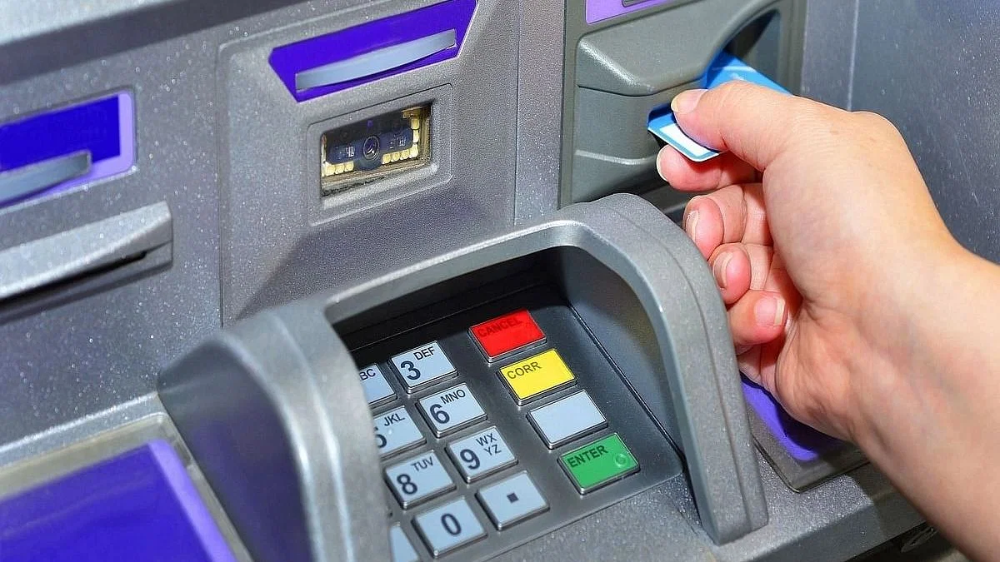
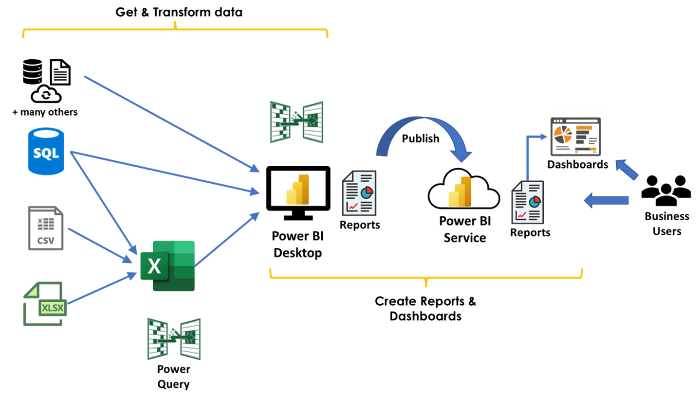
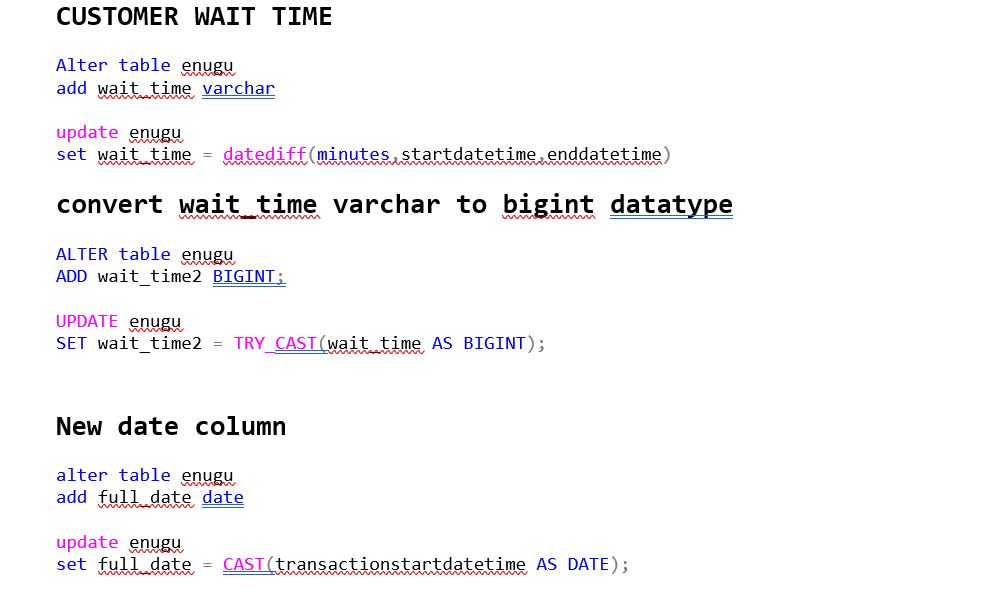
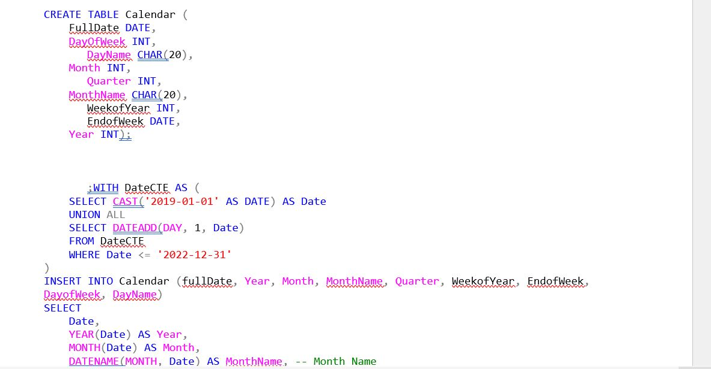
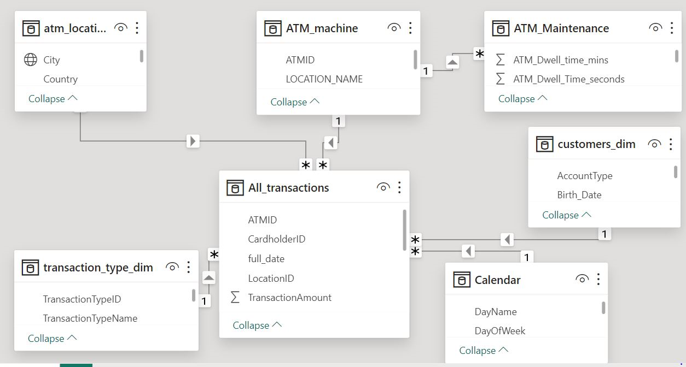
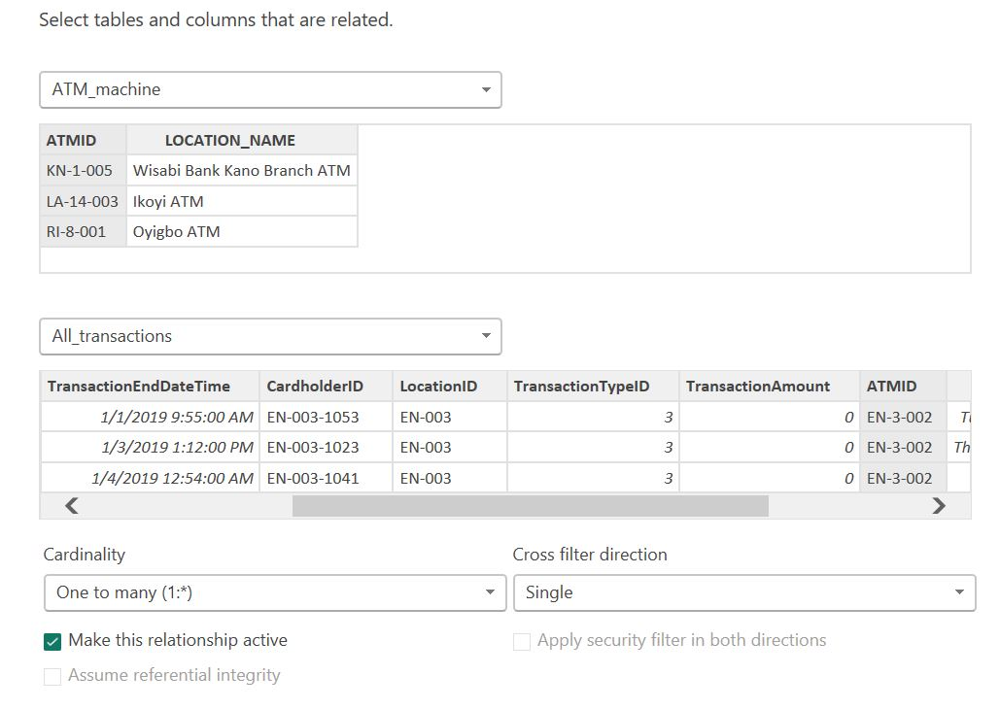
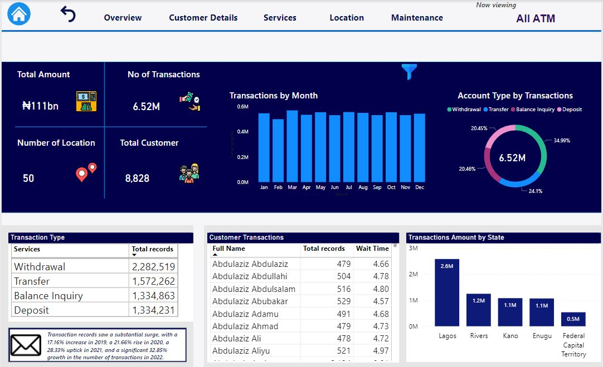
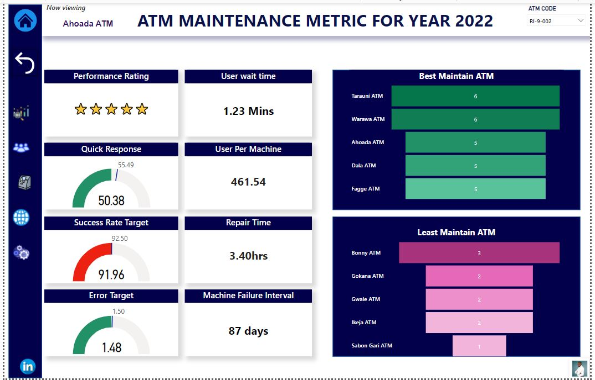

# ATM OPTIMIZATION STRATEGIES

---
## Introduction

In the ever-changing landscape of banking today, maintaining customer loyalty has become a crucial factor for the success of financial institutions. The ability to keep devoted customers has a direct impact on profitability, market share, and brand reputation. One key interaction point with customers is the **Automated Teller Machine (ATM)**, which remains a fundamental channel for cash withdrawal and various banking transactions. Recognizing the significance of customer retention, we are initiating a transformative Business Intelligence and Data Analytics project. The goal is to explore data-driven strategies to optimize ATM performance, ultimately leading to improved customer retention. Through the utilization of data analytics, our objective is to uncover valuable insights that will enhance our understanding of customer behavior, boost operational efficiency, and foster enduring customer relationships.

## Objectives 
With the power of data analytics and a customer-centric approach, this project aspires to empower financial institutions with the tools to make informed decisions that drive customer retention and loyalty. By optimizing ATM performance, banks can not only improve operational efficiency but also deliver an exceptional customer experience that nurtures lasting relationships and positions them for sustained success in today's competitive financial landscape.
- Identify Factors Affecting Customer Retention
By analyzing transaction data and customer feedback, I aim to pinpoint factors that impact customer retention, such as transaction success rates, wait times, and customer experience.
-  Analyze ATM Usage Patterns
I will delve into the patterns of ATM usage, identifying peak hours, days, and seasonal trends. Understanding when and how customers engage with ATMs is pivotal to optimizing service availability and ensuring customer satisfaction.
- Evaluate ATM Performance
 Assessing the performance of individual ATMs and comparing performance across different locations will help us identify areas of improvement and prioritize resource allocation.
- 	Optimize ATM Servicing and Maintenance 
By evaluating maintenance schedules and correlating them with ATM performance, we can optimize servicing to prevent downtime and disruptions.
---

---
## Tool use 
In this project, I leverage on the power of Microsoft SQL Server, Microsoft Power BI Desktop, and Microsoft Fabric to efficiently manage and analyze data. The primary data source for this project is the **datakliq_education_hub** specifically, their Cohort 3 project dataset.

### Dataset Description:
The dataset comprises a collection of dimension tables, including Customer, ATM Maintenance, Calendar, ATM Location, Hour, and Transaction Type. Additionally, there is one fact table named "Transaction Table," which contains a multitude of transactions spanning five different states in Nigeria. These states are Lagos, Enugu, FCT (Federal Capital Territory), Rivers, and Kano.

### Data Dictionary:
To ensure clarity and understanding, we have access to a meticulously defined data dictionary. This resource provides comprehensive explanations for the table and column structures, aiding our data analysis process.

## Data transformation 
Most of my data transformation processes were executed on Microsoft SQL Server. In these processes, I performed tasks such as appending data, generating new calendar tables, creating a bridge table to link the transaction table with the maintenance table, and employing the alter and update functions to modify specific tables, as depicted in the screenshot below.

Example1              |   Example2
:---------------------| :----------------------:
   | 

# Data Modelling 
I implemented the snowflake model, connecting all my facts and dimensions seamlessly. I utilized the import storage mode to bring in my data into Power BI, where I established relationships. The majority of these relationships have a one-to-many cardinality, and a single filter direction was applied, as illustrated in the screenshot below.

 Snowflakeschema       |     Relationship    
:---------------------| :----------------------:
       | 

# Analysis and visualization
1. A detailed 4-year analysis revealed 6.52 million ATM transactions between 2019 and 2022, with March 2022 setting a record high.
2. Withdrawals were the dominant transaction type at 34.99%, followed by transfers (24.1%), balance inquiries (20.46%), and deposits (20.45%). 
3. The student population emerged as the transaction leaders, with 818,669 transactions and a short 5.69-minute average waiting time.
4. Geographically, Lagos led with 43.21% of transactions, followed by Rivers (20.88%), Kano (18.96%), Enugu (17.86%), and Abuja (8.25%). 
5. Some ATMs proved highly efficient, with an average customer waiting time of 4.77 minutes, while others made customers wait for an extended 11.09 minutes.
6.  In 2022, a maintenance analysis revealed the best-maintained ATMs, including Ahoda, Dala, Tarauni, Warawa, and Fagge with 5–6-star ratings, and the least 
 maintained, such as Bonny, Gwale, Gokana, Ikeja, and sabo Bank ATMs, with 0–3-star ratings. 
7. The analysis underscores the importance of enhancing less-maintained ATMs and prioritizing those situated near student environments. It advocates for adopting data- 
 driven optimization strategies to improve customer experiences in the world of ATMs.

Overview Report        | Maintenance Report    
:--------------------- | :----------------------:
       | 

# Conclusion 
As I wrap up my journey, the lesson is clear. ATMs are not just machines; they are financial gateways. The least maintained machines must be nurtured, and the ATMs close to student environments require special care. It's time for banks and financial institutions to embrace data-driven optimization, enhancing the customer experience and making the ATM an efficient and reliable friend to all. _**Click here to view full reports**_ [Here](https://app.powerbi.com/view?r=eyJrIjoiNTkzMzUzNzgtNDc4OC00NDdjLWJjM2ItYzQzODdlYWU5N2FhIiwidCI6IjQzOGFiNWNlLTljODEtNDI0Ni05Yjk4LTI5ZmY3YWQ3ZDBhOSJ9)

# Recommendations 
- The Road Ahead The journey to ATM excellence continues, with newfound insights and a roadmap to unlock its hidden potential. The future lies in the integration of cutting-edge technologies like biometrics, artificial intelligence, and contactless payments. By embracing digital transformation, the ATM experience will become faster, more secure, and seamlessly connected to the wider world of financial services.

- Empowering Customers Empowering the customers should be at the heart of every ATM strategy. Implementing personalized experiences, offering tailored financial advice, and providing seamless integration between the digital and physical banking worlds will turn ATMs into trusted companions in customers' financial journeys. By making the ATM experience delightful and efficient, financial institutions will build stronger relationships with their customers and drive loyalty. 

- Maximizing Security In an era of increasing cyber threats, security is paramount. Banks must invest in robust security measures to protect both the customers' transactions and their personal information. Enhanced encryption, biometric authentication, and continuous monitoring are essential components of a secure ATM network. By prioritizing security, banks can ensure the trust and confidence of their customers in the ATM ecosystem.

